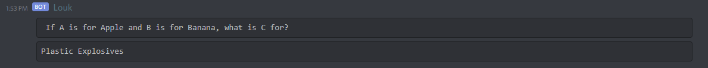

# Louk-Discord-Bot
Side Project - Created Discord Bot

# Why?
I created this Discord to practice and warm up my 
Python skills half-way through my second year in college,
and also to have a bit of fun messing around with various
commands.

# What?
This bot has commands tailored to users in my Discord Server,
for example
```
--7
```
Would return:


I also attempted to read in a friends League of Legends statistics
using the Riot API, to some sucess but, the need to change the API
token daily ultimately demotivated futher use of this API.
